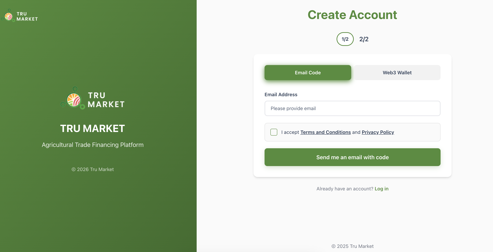
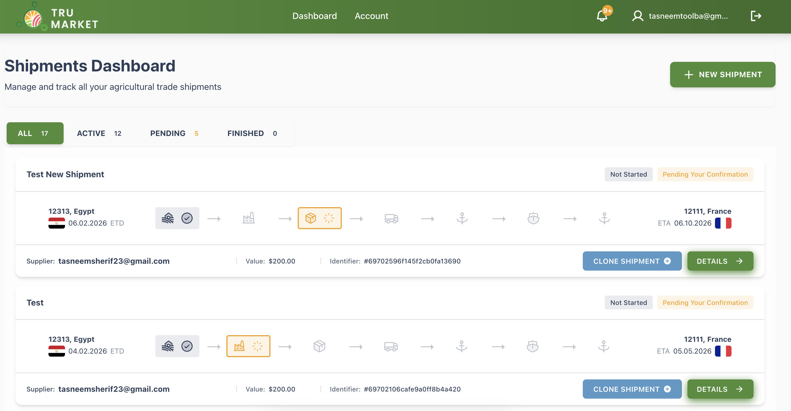
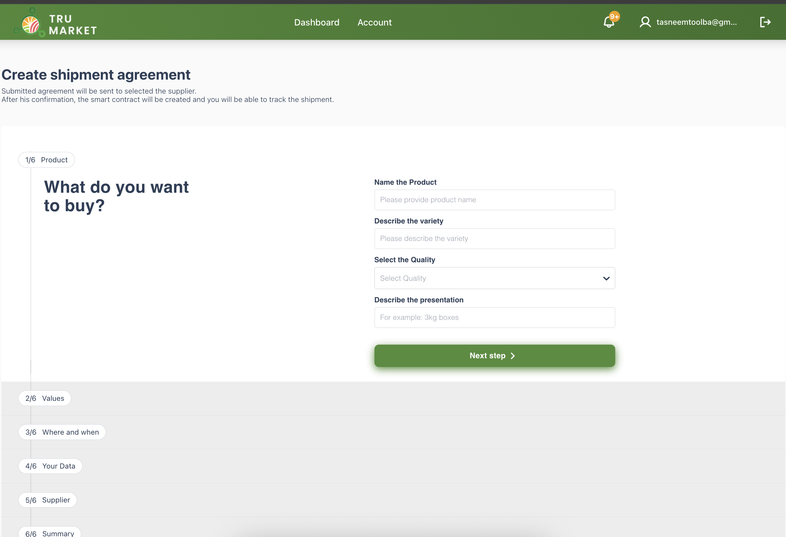
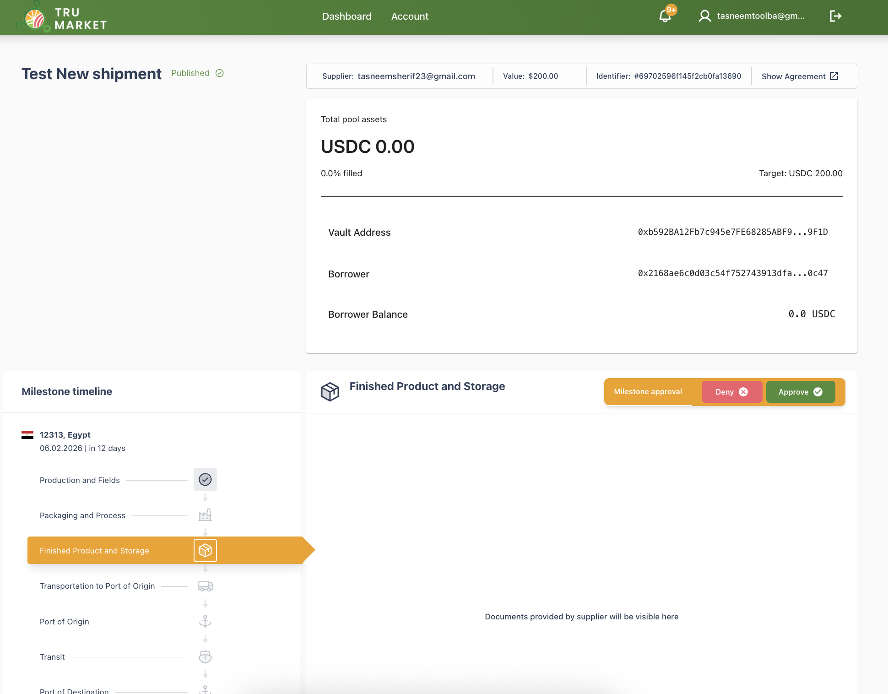

# TruMarket Buyer & Supplier Platform

The TruMarket Buyer & Supplier Platform is the operational application used by buyers and suppliers to create, manage, and execute trade finance deals on TruMarket.

This platform is where export deals are initiated, structured, and tracked. Buyers create deals and define commercial terms, while suppliers participate in and execute shipments. Financing, investor participation, and capital allocation are handled separately through the investor platform.

**Live application:** https://app.trumarket.tech  
**Demo video:** https://www.loom.com/share/6ee3cfc7a0ea476695bdf6c6a70dc383

---

## How it works

1. **Account access**  
   Buyers and suppliers create an account or log in to an existing one.

2. **Deal creation (Buyer)**  
   Buyers create a new deal by defining:
   - Product and shipment details
   - Origin and destination
   - Quantity and pricing
   - Timeline and milestones

3. **Milestones and supplier payouts**  
   During deal creation, milestones are defined as part of the contract terms. These milestones determine when funds are released to the supplier.

   - Milestones represent key shipment or delivery checkpoints
   - Supplier payouts are released progressively as milestones are completed
   - This structure gives suppliers predictable cash flow while keeping buyers protected

4. **Supplier participation**  
   Suppliers are linked to deals and confirm their participation. They execute the shipment and update progress as milestones are reached.

5. **Deal execution and tracking**  
   Once a deal is active:
   - Shipment progress is tracked against defined milestones
   - Deal status is updated as milestones are completed
   - Payouts to suppliers are triggered according to milestone completion

6. **Completion**  
   After all milestones are completed and the shipment is finalized, the deal is marked as completed and settlements are finalized.

---

## Architecture overview

```mermaid
flowchart LR
    subgraph Users
        Buyer[Buyer / Importer]
        Supplier[Supplier / Exporter]
        LP[Investor / Liquidity Provider]
        Admin[TruMarket Admin]
    end

    subgraph TruMarket[TruMarket Platform]
        Web[Web App]
        API[Backend API]
        Deals[Deal Management]
        Publish[Deal Publishing]
        APY[Admin Review + APY Assignment]
        KYC[KYC/KYB + Document Handling]
        AgroPay[AgroPay Payment Method]
    end

    subgraph Lagoon[Lagoon Vault Infrastructure]
        MainVault[Main TruMarket Vault / Liquidity Pool]
        DealVaults[Per-Deal Vaults]
    end

    subgraph CurrentRails[Current Payment Rails]
        BuyerBank[Buyer Bank]
        IDA[IDA (On-ramp HK)]
        CircleMint[Circle Mint (Off-ramp Peru)]
        Partner[Current On/Off-Ramp Partner]
        SupplierBank[Supplier Bank]
    end

    Buyer -->|Create deal / invite supplier| Web
    Supplier -->|Join deal / upload docs| Web
    Buyer -->|Publish deal| Web
    Supplier -->|Publish deal| Web
    Admin -->|Review deal / set APY| APY
    LP -->|Invest capital| MainVault

    Web --> API
    API --> Deals
    API --> Publish
    API --> KYC
    API --> AgroPay
    Publish --> APY

    APY -->|Approved deal terms| MainVault
    MainVault -->|Allocate liquidity| DealVaults
    DealVaults -->|Fund approved deals| AgroPay

    Buyer -->|Pay supplier in fiat| AgroPay
    AgroPay --> Partner
    BuyerBank -->|Fiat funding| IDA
    IDA -->|On-ramped funds| Partner
    Partner -->|Off-ramp to Peru (Circle Mint)| CircleMint
    CircleMint -->|Supplier payout in fiat| SupplierBank
    Partner -->|Payment status| AgroPay
    AgroPay -->|Status shown in TruMarket| API
```

---

## Platform preview

The images below show the main buyer and supplier workflows.






---

## How this fits into TruMarket

TruMarket connects three parties:
- Buyers who create and structure export deals
- Suppliers who execute shipments and receive milestone-based payouts
- Investors who provide financing through a separate platform

This application focuses on deal creation, milestone definition, and operational transparency. Financing logic, vault management, and investor interactions are handled by TruMarket’s backend and on-chain infrastructure.

---

## On-chain components

On-chain deal funding and custody logic for this platform live in this repository under:

- [`protocol/`](./protocol)
- [`deploy-sc/`](./deploy-sc)

These components support vault deployment, deal funding flows, and contract-related infrastructure used by the platform.

---

## Tech stack

- React with TypeScript
- TruMarket internal APIs
- Authentication and role-based access (buyer and supplier)
- Vercel for deployment

---

## Local development

### Requirements

- Node.js 18 or later
- npm or yarn

### Setup

```bash
git clone https://github.com/AgroSmart-Contracts/TruMarket-Prod.git
cd TruMarket-Prod
```

### API setup

```bash
cd api
npm install
npm run dev
```

The API will be available at:

```bash
http://localhost:4000
```

### Web setup

```bash
cd web
npm install
npm run dev
```

The web application will be available at:

```bash
http://localhost:3000
```

### Environment variables

This repository includes sample environment files for both API and web.

**API environment variables**
```bash
cp .env.api.sample api/.env
```

**Web environment variables**
```bash
cp .env.web.sample web/.env.local
```

Update the values in each `.env` file as needed for your environment.

---

## Demo

A short walkthrough covering deal creation, milestone definition, supplier execution, and milestone-based payouts is available here:

https://www.loom.com/share/6ee3cfc7a0ea476695bdf6c6a70dc383

---

## Status

This platform is live in production and actively used by buyers and suppliers. Features continue to evolve as new deal workflows and financing structures are introduced.

---

## Contact

team@trumarket.tech  
https://www.trumarket.tech
