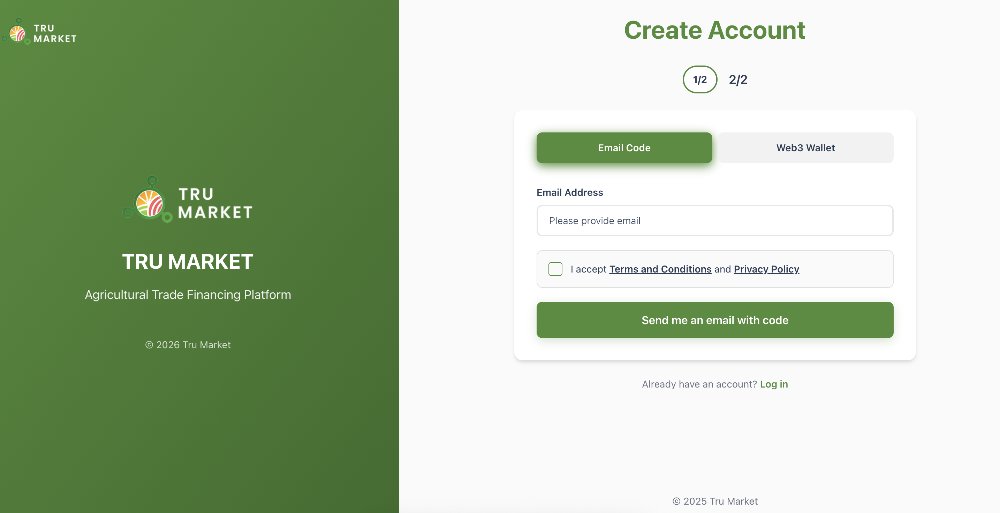
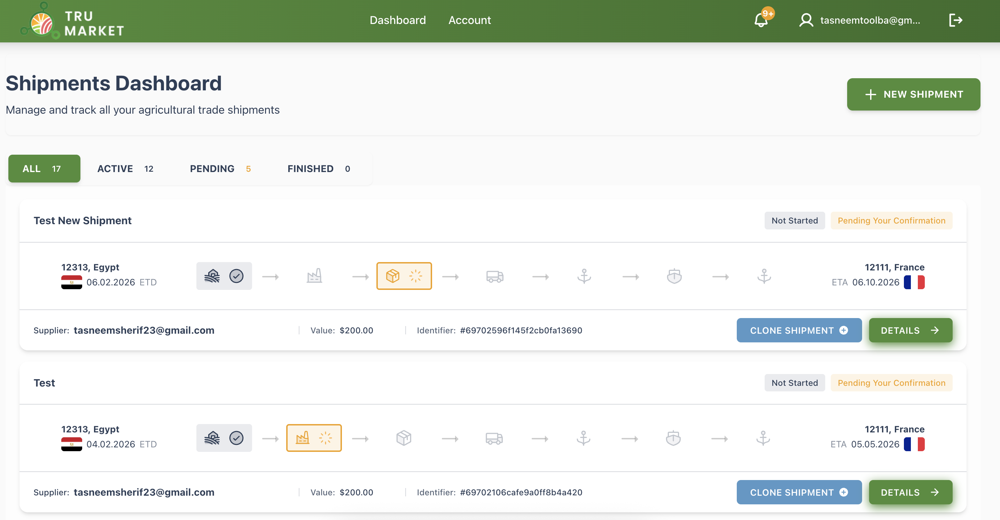
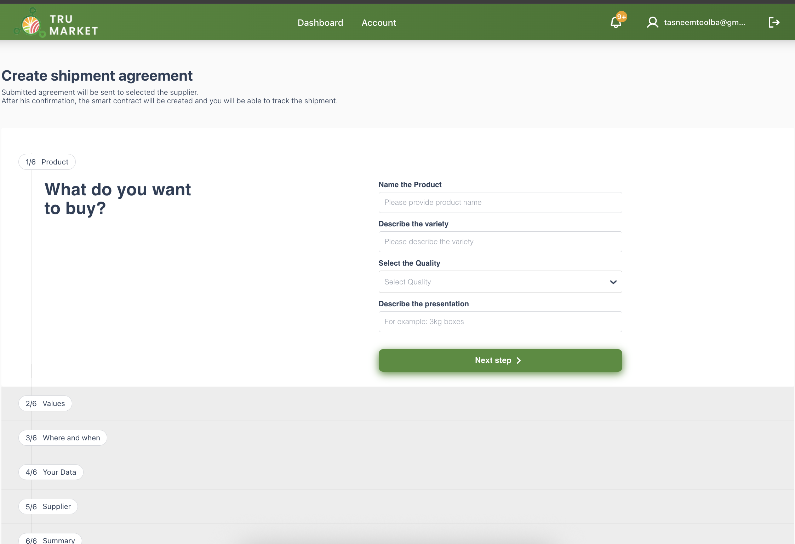
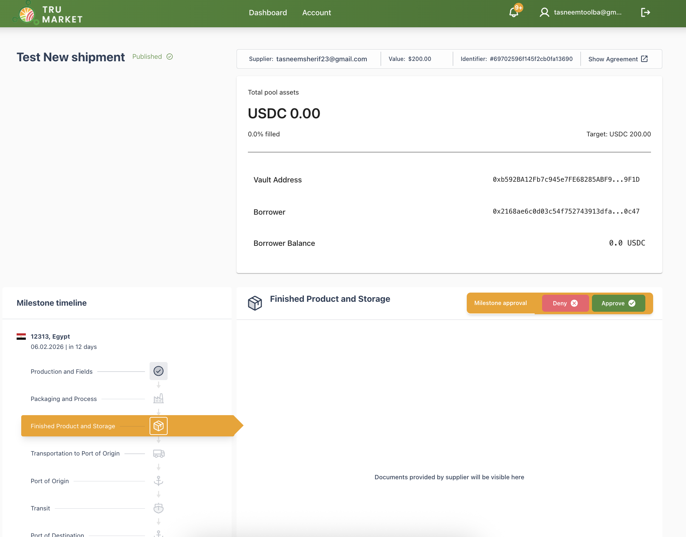

# TruMarket Buyer & Supplier Platform

The TruMarket Buyer & Supplier Platform is the operational application used by buyers and suppliers to create, manage, and execute trade finance deals on TruMarket.

This platform is where export deals are initiated, structured, and tracked. Buyers create deals and define commercial terms; suppliers participate in and execute shipments. Capital allocation, investor participation, and the liquidity pool are handled separately through the [TruMarket Finance investor app](https://github.com/AgroSmart-Contracts/trumarket-finance-with-safe).

- **Live application:** https://app.trumarket.tech
- **Demo video:** https://www.loom.com/share/6ee3cfc7a0ea476695bdf6c6a70dc383
- **Latest release:** [v2.0.0 — Liquidity Pool Model, AgroPay Payment Rail & Bank Account Approval](./CHANGELOG.md)

---

## How it works

1. **Account access** — buyers and suppliers create an account or log in to an existing one.

2. **Deal creation (buyer)** — buyers create a new deal by defining:
   - Product and shipment details
   - Origin and destination
   - Quantity and pricing
   - Timeline and milestones (between 1 and 7, flexible per deal)

3. **Milestones and supplier payouts** — milestones are part of the contract terms and determine when funds are released to the supplier:
   - Each milestone represents a shipment or delivery checkpoint
   - Supplier payouts are released progressively as milestones are completed
   - Buyers stay protected by milestone-gated capital release; suppliers get predictable cash flow

4. **Supplier participation** — suppliers are linked to deals, confirm participation, execute the shipment, and update progress as milestones are reached.

5. **Bank accounts and payment rails**
   - Buyers can register **multiple bank accounts**, which must be approved by both the onramping partner and TruMarket before they can be used.
   - Suppliers register **a single payout account** approved internally by TruMarket.
   - Payouts settle through the **AgroPay / OSN** rail to the supplier's approved account.

6. **Capital allocation** — investor capital is no longer locked into per-deal vaults. Deals are funded from the shared **TruMarket Liquidity Pool** (a Lagoon-backed vault on Base); the platform selects which low-risk deals to fund, and APY is averaged across active allocations. See the [CHANGELOG](./CHANGELOG.md) for the full v2.0.0 architectural shift.

7. **Completion** — once all milestones are completed and the shipment is finalised, the deal is marked completed and settlements close out.

---

## Platform preview






---

## How this fits into TruMarket

TruMarket connects three parties across two applications:

| Party | Where they work | Repository |
| ----- | --------------- | ---------- |
| Buyers and suppliers | This platform — deal creation, milestones, payouts | This repo |
| Investors | TruMarket Finance investor dashboard | [trumarket-finance-with-safe](https://github.com/AgroSmart-Contracts/trumarket-finance-with-safe) |
| On-chain settlement | Smart contracts (TruMarket Deal "Safe", Lagoon liquidity pool on Base) | `protocol/` workspace in this repo |

This application focuses on the **operational side** — deal creation, milestone definition, and supplier execution. Capital sourcing, investor accounting, and pool-level APY live in the investor app.

---

## Project structure

```
trumarket/
├── api/              # NestJS API (Node.js, TypeScript, MongoDB)
├── web/              # Next.js / React buyer & supplier UI
├── protocol/         # Hardhat / Solidity smart contracts (Base)
├── scripts/          # Operator and developer utilities
├── deploy-sc/        # Smart contract deployment helpers
├── infra/docker/     # Docker compose / image config for local + container deploys
├── screenshots/      # README assets
├── docker-compose.yaml
├── Makefile          # `make run` boots the full stack with docker-compose
├── CHANGELOG.md
└── README.md
```

The `api/` directory is the only npm workspace member of the root `package.json`. The `web/` and `protocol/` directories are independent npm projects with their own `package.json` and `node_modules`.

---

## Tech stack

| Layer | Stack |
| ----- | ----- |
| API | NestJS, TypeScript, MongoDB / Mongoose, Sentry |
| Web | Next.js, React, TypeScript, Tailwind, viem / wagmi |
| Smart contracts | Solidity, Hardhat, OpenZeppelin (deployed on **Base**) |
| Auth | Web3Auth (investor wallet), email/password for operators |
| Payments | AgroPay / OSN (Open Settlement Network) rail for fiat payout settlement |
| Local dev | Docker Compose, Makefile |

---

## Local development

### Requirements

- Node.js 18 or later
- npm
- Docker + Docker Compose (for the one-command stack)

### Clone

```bash
git clone https://github.com/AgroSmart-Contracts/trumarket.git
cd trumarket
```

### Run the full stack with Docker

```bash
make run
```

This boots the API, web app, and supporting services via `docker-compose.yaml`.

### Run the API and web separately

API:

```bash
cd api
npm install
npm run dev
# → http://localhost:4000
```

Web:

```bash
cd web
npm install
npm run dev
# → http://localhost:3000
```

### Smart contracts

```bash
cd protocol
npm install
npx hardhat compile
npx hardhat test
```

Contract deployment is driven by Hardhat config in `protocol/hardhat.config.ts` and helper scripts in `deploy-sc/`. Required env vars (RPC URLs, private keys, Etherscan API keys) are read from `process.env` — never commit these.

### Environment variables

```bash
cp .env.api.sample api/.env
cp .env.web.sample web/.env.local
```

Update each `.env` with values for your environment. Both sample files document the variables they expect.

---

## Changelog

All notable architectural and behavioural changes are tracked in [`CHANGELOG.md`](./CHANGELOG.md), organised by semver-classified version ranges with blast radius, narrative, and migration notes.

Highlights:

- **v2.0.0 — Liquidity Pool Model, AgroPay Payment Rail & Bank Account Approval (Mar–May 2026)** — per-deal vaults replaced with a shared Lagoon-backed pool; flexible 1-N milestones; AgroPay / OSN payment rail; role-specific bank account approval flows.
- **v1.2.0 — ICP & AWS Decommissioned (Nov–Dec 2025)** — ICP data layer and AWS Terraform infrastructure removed; platform consolidated on MongoDB.
- **v1.1.0 — UI Redesign + Smart Contract Security Audit (Oct–Nov 2025)** — `DealsManager` / `DealVault` audit findings resolved (C-01, C-02, H-02, M-01, L-01, L-10); design system refresh; CI/CD added.

---

## Demo

A short walkthrough covering deal creation, milestone definition, supplier execution, and milestone-based payouts:

https://www.loom.com/share/6ee3cfc7a0ea476695bdf6c6a70dc383

---

## Status

Live in production at https://app.trumarket.tech and actively used by buyers and suppliers. Features evolve as new deal workflows and financing structures are introduced — see the [changelog](./CHANGELOG.md) for the moving parts.

---

## Contact

**team@trumarket.tech** · [https://www.trumarket.tech](https://www.trumarket.tech)
