# Circle Developer Grant — Milestone 1 Submission Pack

**Project:** TruMarket  
**Grant milestone:** Milestone #1 — Arc Testnet Launch ($5,000)  
**Contact:** team@trumarket.tech · https://www.trumarket.tech  
**Live buyer/supplier app:** https://app.trumarket.tech  
**Repos:** [trumarket](https://github.com/AgroSmart-Contracts/trumarket) · TruMarket Finance (investor app)

### Arc testnet deployment (validated)

| Contract | Address | Explorer |
|----------|---------|----------|
| **DealVaultFactory** | `0x5Dacdbb79A558f9395367badDc6d351053D58B08` | [Arcscan](https://testnet.arcscan.app/address/0x5Dacdbb79A558f9395367badDc6d351053D58B08) |
| **DealsManager** | `0x0F1a18BE854e9924158474fB6828287eAB10F6F6` | [Arcscan](https://testnet.arcscan.app/address/0x0F1a18BE854e9924158474fB6828287eAB10F6F6) |

**Demo video:** [circle-grant-demo.mov (Google Drive)](https://drive.google.com/file/d/1NeCvWUh7oST5LnjcAdfAEHlI3r6Uqyt0/view?usp=sharing)

---

## 1. Executive summary

TruMarket is a **production cross-border agricultural trade-finance platform**. Buyers and suppliers operate deals in the main app; investors fund a **shared USDC liquidity pool** (Lagoon on Base) via the Finance app.

For this Circle grant we integrate **three Circle products**:

| Circle product | Where | Role |
|----------------|-------|------|
| **USDC** | Base (prod), Arc testnet (grant target) | Deal vault bookkeeping, borrower repayment, pool asset |
| **CCTP v2 + Bridge Kit** | TruMarket Finance `/treasury` (ops-only) + CLI | Bidirectional ops bridging: testnets ↔ **Arc testnet** (grant demo); testnets → **Base** (Lagoon); **Arc → Base Sepolia** (return treasury USDC) |
| **Circle Mint** | TruMarket Finance (`institution` portal mode) | Bank & institution investors fund via wire / business account |

**Important architectural truth (v2.0):** Supplier fiat payouts and deal operations are **off-chain** (MongoDB + AgroPay). On-chain contracts provide **deal identity** (ERC-721 NFT + per-deal `DealVault`) and borrower repayment. Investor capital flows through the **Lagoon pool**, not per-deal vault deposits. **Milestones and supplier payments are off-chain only** — not enforced on-chain.

---

## 2. Milestone #1 deliverables checklist

| # | Deliverable | Status | Evidence |
|---|-------------|--------|----------|
| 1 | Launch on **Arc testnet** with core functionality validated | ✅ Deployed | `DealsManager` + `DealVaultFactory` on Arc testnet (addresses above); `protocol/scripts/deploy-arc.ts`, [DEPLOY-ARC.md](../protocol/docs/DEPLOY-ARC.md) |
| 2 | Continue / enhance **Circle CCTP** integration | ✅ Shipped | Finance `/treasury` (bidirectional Bridge Kit UI + Arc in wagmi), `GET /api/cctp/config`, CLI `bridge-to-arc.ts` — see [Figure 3](#diagram-b--ops-cctp-treasury) |
| 3 | **Circle Mint** for institutional investors | ✅ Restored | Finance app `/api/circle/*` + institution portal mode |
| 4 | Progress report + learnings | ✅ This document | + architecture diagrams (§3, §4) |
| 5 | Demo video | ✅ Available | [circle-grant-demo.mov](https://drive.google.com/file/d/1NeCvWUh7oST5LnjcAdfAEHlI3r6Uqyt0/view?usp=sharing) |

---

## 3. System architecture (accurate v2.0)

### Diagram A — Circle integration overview (hero)



*Figure 1 — End-to-end architecture (v2): three apps, Finance `/treasury` bidirectional CCTP, dual investor rails (web3 + Circle Mint), Lagoon pool on Base, and on-chain deal identity on Arc. Buyer/supplier app has no bridge UI.*

### 3.1 Three apps

```
┌─────────────────────────────────────────────────────────────────┐
│  trumarket/web + api          Buyer & supplier operations       │
│  • Deal create, trade docs, AgroPay payouts                      │
│  • Auto-mint deal NFT + DealVault on create (when enabled)      │
│  • Bank/fiat ops only — no wallet or CCTP UI                    │
└─────────────────────────────────────────────────────────────────┘
                              │
┌─────────────────────────────────────────────────────────────────┐
│  admin-dashboard              TruMarket ops                     │
│  • Publish deals, verify payment documents                      │
│  • Payment document verification and fiat payout oversight     │
│  • Allocate pool capital to deals (off-chain decision)          │
│  • Fiat/OSN oversight — no on-chain bridge UI                   │
└─────────────────────────────────────────────────────────────────┘
                              │
┌─────────────────────────────────────────────────────────────────┐
│  TruMarket Finance            Investors + ops treasury          │
│  • web3: wallet → Lagoon pool deposit (Base USDC)             │
│  • institution: Circle Mint wire / deposit address              │
│  • ops /treasury: CCTP Bridge Kit (treasury wallet only)        │
└─────────────────────────────────────────────────────────────────┘
                              │
┌─────────────────────────────────────────────────────────────────┐
│  protocol/                    On-chain (Base prod / Arc testnet)  │
│  DealsManager 0x0F1a…F6F6 + DealVaultFactory 0x5Dac…8B08       │
│  mint · donateToDeal · setDealCompleted · transferFromVault       │
└─────────────────────────────────────────────────────────────────┘
```

### 3.2 What `DealVault` does today



*Figure 2 — Deal create flow: MongoDB record → API mint → `DealsManager.mint(maxDeposit, borrower)` → per-deal `DealVault` on Arc.*

When a deal is created with `AUTOMATIC_DEALS_ACCEPTANCE=true`:

1. API calls `DealsManager.mint(maxDeposit, buyerWallet)` via `BlockchainService.mintNFT()`
2. Contract deploys a new **ERC-4626 `DealVault`** owned by `DealsManager` (paused/blocked for direct deposits at mint)
3. Deal record stores `nftID`, `mintTxHash`, `vaultAddress`

**v2.0:** Live investor USDC goes to the **Lagoon pool**, not into `DealVault.deposit()`. The vault holds:
- Residual USDC from legacy flows
- Borrower **repayment** via `donateToDeal` (when deal reaches `finished` status)
- Read-only funding display in shipment UI

**CCTP does not auto-fund the vault.** CCTP moves USDC via the **ops treasury wallet** on Finance `/treasury`. Pool allocation and deal funding are **admin decisions** off-chain.

### 3.3 CCTP flow (admin-operated)



*Figure 3 — Ops-operated bidirectional CCTP via Bridge Kit on Finance `/treasury` (`TreasuryBridgePanel.tsx`). Not automatic per deal; not visible to buyers or retail investors.*

**Who:** TruMarket treasury ops in **TruMarket Finance** (`/treasury` — `NEXT_PUBLIC_ENABLE_TREASURY_CCTP=true`). Buyers/suppliers never see this UI.

**Flow (see diagram):**

1. Ops opens Finance → `/treasury`
2. Connect treasury wallet (RainbowKit; Arc chain `5042002` in wagmi)
3. `GET /api/cctp/config` loads supported source/destination chains
4. Select route → Bridge Kit: approve → burn → attestation → mint
5. Outcome on destination chain (Arc Testnet, Base Sepolia, or Base mainnet)

**Supported routes (Bridge Kit, ops wallet via RainbowKit):**

| Direction | Typical use |
|-----------|-------------|
| `Base_Sepolia` / `Ethereum_Sepolia` / `Arbitrum_Sepolia` → `Arc_Testnet` | Fund ops wallet on Arc before deal mint / grant demo |
| `Arc_Testnet` → `Base_Sepolia` | Return USDC from Arc grant demos to testnet treasury |
| Testnets → `Base` (mainnet) | Consolidate USDC onto Lagoon pool chain |

**CLI alternative (inbound only):** `protocol/scripts/cctp/bridge-to-arc.ts` → `npm run bridge:arc`

Arc Testnet is registered in wagmi when CCTP is enabled (chain ID `5042002`). Optional env: `NEXT_PUBLIC_ARC_RPC_URL`, `NEXT_PUBLIC_OPS_EMAIL_ALLOWLIST`, per-chain RPC URLs (`NEXT_PUBLIC_BASE_SEPOLIA_RPC_URL`, etc.). **No Circle API key** is required for CCTP — Bridge Kit runs in the browser with the connected ops wallet.

### 3.4 Circle Mint flow (institution investors)



*Figure 4 — Web3 investors deposit via wallet to Lagoon pool; institutions use Circle Mint (wire / deposit address) without self-custody wallets.*

**Who:** Banks & institutions on Finance app with `NEXT_PUBLIC_INVESTOR_PORTAL_MODE=institution`.

---

## 4. Architecture diagrams (attach to Circle portal)

All figures are included above in §3 and collected here for export. Source files:

| Figure | File | Use in submission |
|--------|------|-------------------|
| 1 — Hero overview (v2) | [`grant-diagrams/trumarket_circle_overview.svg`](./grant-diagrams/trumarket_circle_overview.svg) | Architecture diagram / cover |
| 2 — Deal mint on Arc | [`grant-diagrams/trumarket_deal_creation_arc.svg`](./grant-diagrams/trumarket_deal_creation_arc.svg) | Arc testnet core functionality |
| 3 — Ops CCTP treasury | [`grant-diagrams/trumarket_cctp_treasury_bridge.svg`](./grant-diagrams/trumarket_cctp_treasury_bridge.svg) | CCTP integration evidence |
| 4 — Dual investor rails | [`grant-diagrams/trumarket_dual_investor_rails.svg`](./grant-diagrams/trumarket_dual_investor_rails.svg) | Circle Mint + web3 pool |

### Diagram A — Circle integration overview (hero)


### Diagram B — Ops CCTP treasury


### Diagram C — Deal creation → on-chain identity


### Diagram D — Dual investor portal modes


---

## 5. Progress report & learnings (Milestone #1 narrative)

### What we shipped
- **Arc testnet contracts deployed** — `DealVaultFactory` and `DealsManager` live on Arc testnet (addresses at top of this doc)
- CCTP Bridge Kit UI on Finance `/treasury` (ops-only, route swap, progress stepper) + `GET /api/cctp/config` + CLI `bridge-to-arc.ts`
- **Bidirectional** CCTP routes including **Arc Testnet ↔ Base Sepolia** (not only inbound to Arc)
- Arc Testnet in wagmi/RainbowKit for ops wallet chain switching during bridges
- Updated architecture diagrams (hero overview v2 + ops treasury swimlane)
- Deal auto-mint pipeline (NFT + DealVault per deal)
- Circle Mint restored with server-side API proxy and dual investor portal modes
- v2.0 liquidity pool model (Lagoon) decoupled from per-deal vault deposits
- **Grant demo video** recorded end-to-end (buyer app, Finance pool, `/treasury` CCTP, Arc explorer)

### What we learned
- **CCTP fits the capital mobility layer**, not the deal registry — bridging USDC to Arc is an admin ops action separate from `mint()`
- **Treasury flows are bidirectional** — after grant demos on Arc, ops need to move USDC back to Base Sepolia or Base mainnet without a separate tool
- **DealVault remains valuable** for deal identity, borrower repayment, and grant-demo explorer links even when investor deposits use Lagoon
- **Circle Mint** is the right rail for institutions that cannot use self-custody wallets
- **Off-chain milestones** simplify ops — grant demos should show document verification + fiat payouts, not on-chain milestone fund release

### Next steps (Milestone #2)
- Deploy `DealsManager` on Arc mainnet within 30 days of Arc mainnet launch
- Wire CCTP post-bridge into Lagoon pool deposit helper

---

## 6. Demo video script (what to say)

The recorded demo follows this flow. Video: [circle-grant-demo.mov](https://drive.google.com/file/d/1NeCvWUh7oST5LnjcAdfAEHlI3r6Uqyt0/view?usp=sharing)

### Scene 1 — Buyer/supplier app (45s) — *no wallets*

**Show:** `app.trumarket.tech` — create or open a deal, upload a trade doc.

**Say:** “TruMarket serves agricultural buyers and suppliers through a web2 workflow. They pay TruMarket by bank transfer; we settle suppliers through AgroPay. There is no crypto wallet in this app — milestones and payments are tracked in our API.”

### Scene 2 — Finance: institutional funding (60s)

**Show:** Finance app, `institution` mode → email login → Profile → Circle Mint deposit (wire instructions or deposit address).

**Say:** “Institutional investors fund through Circle Mint — wire USD or USDC to a Circle business account without self-custody wallets. Capital is pooled for allocation to verified trade programs.”

### Scene 3 — Finance: web3 pool deposit (45s)

**Show:** Finance app, `web3` mode → connect wallet on **Base** → Pool → deposit USDC into Lagoon vault.

**Say:** “Crypto-native investors deposit USDC directly into our shared Lagoon liquidity pool on Base. One chain, one transaction — no cross-chain step for retail investors.”

### Scene 4 — Finance: ops CCTP treasury (60s) — *grant highlight*

**Show:** Finance `/treasury` → connect ops wallet → **(A)** source **Base Sepolia** → destination **Arc Testnet** → bridge USDC → Arc explorer balance; then **(B)** swap route → **Arc Testnet** → **Base Sepolia** to show return flow.

**Say:** “Cross-chain USDC is an internal treasury operation, not something buyers or investors click. We use Circle CCTP v2 and Bridge Kit on the Finance `/treasury` page to move ops USDC onto Arc testnet where our deal registry contracts live, and back to Base Sepolia when demos complete. Retail investors still deposit directly to the Lagoon pool on Base — they never use this screen.”

### Scene 5 — On-chain deal identity (45s)

**Show:** Arcscan for deployed `DealsManager` (`0x0F1a18BE854e9924158474fB6828287eAB10F6F6`) — `DealCreated` event, new `DealVault` address per mint.

**Say:** “Each shipment deal registers on Arc as an ERC-721 with a USDC vault for borrower repayment and auditability. Investor capital does not flow through this vault in v2.0 — the pool on Base funds deals off-chain.”

### Do **not** claim

- Per-milestone on-chain fund release  
- CCTP auto-funds every deal or vault  
- Buyers bridge crypto in the main app  

---

## 7. Links to attach

| Resource | URL |
|----------|-----|
| Live buyer/supplier app | https://app.trumarket.tech |
| **Demo video** | https://drive.google.com/file/d/1NeCvWUh7oST5LnjcAdfAEHlI3r6Uqyt0/view?usp=sharing |
| DealsManager (Arc testnet) | https://testnet.arcscan.app/address/0x0F1a18BE854e9924158474fB6828287eAB10F6F6 |
| DealVaultFactory (Arc testnet) | https://testnet.arcscan.app/address/0x5Dacdbb79A558f9395367badDc6d351053D58B08 |
| Circle flow doc | [CIRCLE-GRANT-SMART-CONTRACT-FLOW.md](../protocol/docs/CIRCLE-GRANT-SMART-CONTRACT-FLOW.md) |
| Arc deploy guide | [DEPLOY-ARC.md](../protocol/docs/DEPLOY-ARC.md) |
| Changelog | [CHANGELOG.md](../CHANGELOG.md) |
