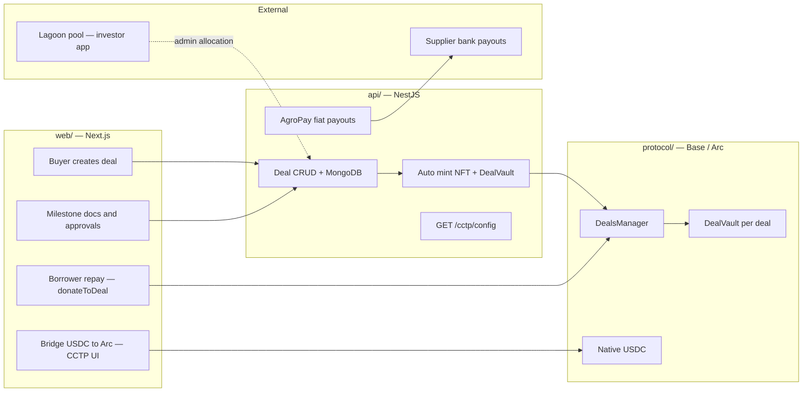

# TruMarket — Web3 Grant Application Pack

Grant-ready context for **this repo** (`api/` + `web/`, with `protocol/` as the on-chain layer they integrate with).

**Related docs in this repo:**

- **[Milestone 1 submission pack](./CIRCLE-GRANT-MILESTONE-1-SUBMISSION.md)** — filled form, demo script, architecture diagrams ([`grant-diagrams/`](./grant-diagrams/))
- [Circle grant smart contract flow](../protocol/docs/CIRCLE-GRANT-SMART-CONTRACT-FLOW.md)
- [Arc testnet deployment](../protocol/docs/DEPLOY-ARC.md)
- [Protocol README](../protocol/README.md)
- [Platform README](../README.md)

---

## 1. Project context (for any grant application)

### One-liner

**TruMarket** is a production trade-finance platform where **buyers and suppliers** create, execute, and settle cross-border shipment deals — with **on-chain deal identity, milestone state, and USDC repayment** anchored by smart contracts, and **fiat supplier payouts** via AgroPay.

### Live product proof

| Item | Value |
|------|--------|
| **Buyer/supplier app** | https://app.trumarket.tech |
| **Demo video** | https://www.loom.com/share/6ee3cfc7a0ea476695bdf6c6a70dc383 |
| **Repo** | https://github.com/AgroSmart-Contracts/trumarket |
| **Contact** | team@trumarket.tech |
| **Current version** | v2.0.0 (Lagoon liquidity pool model) |
| **Production chain today** | **Base mainnet** (`DealsManager` + USDC) |

### Problem & market

- Cross-border agri/export trade needs **milestone-gated financing** and **auditable settlement**.
- Buyers want protection (funds release only when milestones are met); suppliers want predictable cash flow.
- Traditional trade finance is slow, opaque, and hard to audit on-chain.

### How it works (v2.0)

1. **Buyer** creates a shipment deal (product, route, milestones, commercial terms).
2. **API** persists the deal and, when enabled, **mints an on-chain deal NFT** and deploys a **per-deal USDC vault**.
3. **Milestones** gate supplier progress off-chain (documents + AgroPay payouts); on-chain `proceed()` exists in contracts but is **not wired in v2.0 API**.
4. **Investor capital (v2.0)** flows through a **shared Lagoon pool** (separate app), not per-deal vault deposits.
5. **Borrower repayment** happens on-chain via `donateToDeal` in the web UI.
6. **Supplier fiat payouts** settle through **AgroPay** to approved bank accounts.

### Traction signals you can cite

- **Production app** live at https://app.trumarket.tech (not a hackathon prototype).
- **Full stack shipped**: API, web, contracts on Base, AWS infra, admin panel, KYC/OTP, notifications, payment doc classification.
- **Security**: Smart contract audit fixes in v1.1.0; Hardhat test suite.
- **Real-world finance rails**: AgroPay supplier payout integration (v2.0).
- **Circle alignment doc already written**: [CIRCLE-GRANT-SMART-CONTRACT-FLOW.md](../protocol/docs/CIRCLE-GRANT-SMART-CONTRACT-FLOW.md).
