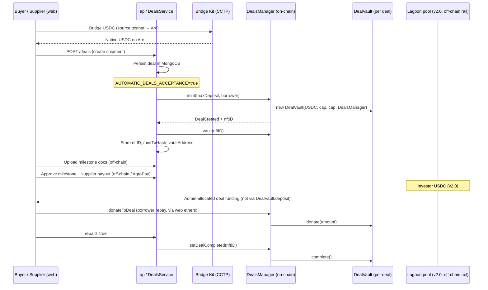

# TruMarket smart contract flow & Circle grant alignment

This document describes how TruMarket’s on-chain contracts integrate with the product flow, and how that architecture supports the **Circle grant milestones** (Arc testnet → Arc mainnet, USDC, CCTP).

---

## Executive summary

TruMarket uses **`DealsManager`** (ERC-721 deal registry) and per-deal **`DealVault`** (ERC-4626 USDC vault) on an EVM chain. When a shipment deal is created in the app, the API can call `DealsManager.mint(maxDeposit, borrower)`, which **deploys a new `DealVault`** and registers the deal as an NFT.

Since **v2.0**, live **investor** capital flows through a shared **Lagoon liquidity pool** (separate repo). **Milestones and supplier payouts are off-chain** (MongoDB + AgroPay). The on-chain contracts remain the **source of truth for deal identity and borrower repayment** — which grant reviewers can validate on Arc with native **USDC**.

**Implementation status (this repo):**

| Feature | Status | Location |
|---------|--------|----------|
| Auto-mint + `DealVault` on deal create | ✅ | `api/src/deals/deals.service.ts` (`AUTOMATIC_DEALS_ACCEPTANCE`) |
| CCTP bridge CLI (testnet → Arc) | ✅ | `protocol/scripts/cctp/bridge-to-arc.ts` → `npm run bridge:arc` |
| CCTP bridge UI | ✅ | Finance app `/treasury` + CLI `bridge-to-arc.ts` |
| CCTP config API | ✅ | `GET /cctp/config` |
| Arc testnet Hardhat network | ✅ | `hardhat.config.ts` → `arcTestnet` |
| Arc deploy script | ✅ | `npm run deploy:arc` → [DEPLOY-ARC.md](./DEPLOY-ARC.md) |
| Lagoon pool deposit after bridge | 🔜 | `trumarket-finance-with-safe` (separate repo) |

---

## End-to-end flow (product ↔ contracts)

### Step-by-step

| Step | Layer | What happens |
|------|--------|--------------|
| 0. Bridge USDC (optional) | Finance `/treasury` or CLI | Circle Bridge Kit (CCTP v2): ops wallet bridges USDC cross-chain. `npm run bridge:arc` or Finance `/treasury` (not buyer/supplier app). |
| 1. Create deal | `web/` → `api/` | User submits shipment form; `DealsService.createDeal()` writes MongoDB record (milestones, parties, `investmentAmount`). |
| 2. Mint on-chain | `api/` → `DealsManager` | If `AUTOMATIC_DEALS_ACCEPTANCE=true`, `applyMintAndVaultIfEnabled()` calls `BlockchainService.mintNFT()` → `DealsManager.mint()`. Each mint **deploys one `DealVault`**. |
| 3. Persist chain metadata | `api/` | Stores `nftID`, `mintTxHash`, `vaultAddress`; registers vault for log sync (`SyncDealsLogsJob`). |
| 4. Milestone tracking | `api/` + docs | Documents, status, and supplier payouts tracked off-chain (DB + payments module). |
| 5. Investor funding (v2.0) | Lagoon pool | USDC enters shared pool; admins allocate to deals — **not** `DealVault.deposit()` for new flows. |
| 6. Borrower repayment | `web/` + `DealsManager` | `ShipmentFinance.tsx` calls `donateToDeal` with USDC approve. |
| 7. Deal completion | `api/` | `setDealAsRepaid` → `setDealCompleted` → vault `complete()`. |

### Configuration

| Variable | Purpose |
|----------|---------|
| `AUTOMATIC_DEALS_ACCEPTANCE=true` | Mint NFT + deploy `DealVault` on deal create (and on legacy confirm). Set in `docker-compose.yaml` for local/dev. |
| `DEALS_MANAGER_CONTRACT_ADDRESS` | Deployed `DealsManager` on target chain (Base today; Arc testnet for grant M1). |
| `INVESTMENT_TOKEN_CONTRACT_ADDRESS` | USDC on that chain (6 decimals on Base/Arc). |
| `BLOCKCHAIN_RPC_URL` / `BLOCKCHAIN_PRIVATE_KEY` | API wallet (must be `DealsManager` owner for `mint`). |
| `ARC_*` env vars | Arc testnet RPC, USDC address — see [DEPLOY-ARC.md](./DEPLOY-ARC.md) |

Admin fallback: `POST /admin/deals/:dealId/nft/mint` performs the same mint if automatic path was off.

### CCTP (Circle Cross-Chain Transfer Protocol)

TruMarket does **not** embed CCTP Solidity. Circle’s **TokenMessengerV2** / **MessageTransmitterV2** are pre-deployed on Arc (domain `26`). We integrate via **Bridge Kit**:

- **CLI:** `protocol/scripts/cctp/bridge-to-arc.ts`
- **Web:** Finance app `src/lib/cctp/bridgeUsdc.ts` + `/treasury`
- **Config:** `GET /cctp/config`

**Ops routes (Finance `/treasury`, Bridge Kit):** bidirectional among `Arc_Testnet`, `Base_Sepolia`, `Ethereum_Sepolia`, `Arbitrum_Sepolia`, and `Base` (mainnet). CLI `bridge-to-arc` remains **inbound only** (testnets → `Arc_Testnet`).

---

## Contract roles (v2.0)

### DealsManager (`TMD`)

- **`mint(maxDeposit, borrower)`** — Owner-only. Mints ERC-721 token ID, **`new DealVault(...)`** (paused/blocked for direct deposits), stores deal struct.
- **`donateToDeal(tokenId, amount)`** — Borrower repays USDC into the deal vault.
- **`setDealCompleted(tokenId)`** — Marks deal complete; calls `vault.complete()` when repayment exceeds `maxDeposit`.
- **`transferFromVault(tokenId, amount, toBorrower)`** — Admin vault transfer.

### DealVault (`DLS`)

- Deployed **once per deal** at mint time.
- **Active (v2.0):** `transferToBorrower`, `donate`, `complete`, `pause`, `blockDeposits`.
- **Legacy (v1.x):** `deposit` / `redeem` — direct investor path; retained for compatibility, not used for v2.0 investor flows.

Underlying token: **USDC** — aligns with Circle grant requirements.

---

## How this maps to Circle grant milestones

Grant structure (from Circle program):

| Grant milestone | Requirement | TruMarket alignment |
|-----------------|-------------|---------------------|
| **M1 — $5,000** | Launch on **Arc testnet** with core functionality validated | Deploy `DealsManager` + USDC on Arc testnet; set API env to Arc RPC; create deal in app → **on-chain mint + `DealVault` deploy** verifiable via explorer. Demo: deal NFT, vault address, milestone `proceed`, borrower `donateToDeal`. |
| **M1** | Maintain / enhance **Circle CCTP** integrations | Cross-chain USDC into Lagoon pool (investor app / `trumarket-finance-with-safe`); CCTP moves USDC between chains **into pool capital**, while **deal registry stays on Arc** (or home chain). Composes: CCTP (liquidity) + DealsManager (deal truth). |
| **M1 (optional)** | **Circle Bridge Kit** for simplified cross-chain USDC | Optional UX layer on top of CCTP for investor deposits; does not replace on-chain deal contracts. |
| **M1** | Progress report | This doc + demo video: create deal → mint tx → vault → milestone event logs. |
| **M2 — $5,000** | **Arc mainnet** within 30 days of Arc mainnet launch | Redeploy or upgrade `DealsManager` on Arc mainnet; point production API/web ABIs and addresses; regression test mint/proceed/donate/complete. |
| **M2** | Validation artifacts | Explorer links, testnet/mainnet addresses, Hardhat test suite (`protocol/test/`), live app demo. |

### Why the split architecture makes sense for Circle

1. **USDC-native on Arc** — `DealVault` and `DealsManager` use ERC-20 USDC (6 decimals). Arc is USDC-first; no custom stablecoin needed for grant scope.
2. **Verifiable on-chain state** — Each shipment gets an NFT + vault address at mint. Grant reviewers can inspect `DealCreated`, `DealMilestoneChanged`, and `DealCompleted` events without trusting off-chain DB alone.
3. **CCTP fits the capital layer, not the deal registry** — v2.0 routes **investor** USDC through Lagoon + CCTP; **deal identity and repayment** stay in `DealsManager`/`DealVault`. That matches “enhance Circle integrations” while keeping shipment finance auditable on Arc.
4. **Empty vault + off-chain funding** — `proceed()` handles zero-balance vaults (off-chain/Lagoon-funded deals). On-chain milestone machine still runs; USDC releases when vault holds funds (e.g. borrower repay).
5. **Testnet → mainnet path** — Same Solidity, Hardhat deploy scripts, API `BlockchainService` — only RPC, USDC address, and `DEALS_MANAGER_CONTRACT_ADDRESS` change for Arc.

---

## Code touchpoints

| Path | Responsibility |
|------|----------------|
| `protocol/contracts/DealsManager.sol` | Mint, proceed, donate, complete |
| `protocol/contracts/DealVault.sol` | Per-deal USDC vault |
| `protocol/scripts/deploy-arc.ts` | Deploy DealsManager on Arc testnet |
| `protocol/scripts/cctp/bridge-to-arc.ts` | CLI CCTP bridge to Arc |
| `api/src/cctp/` | `GET /cctp/config` for web |
| `api/src/blockchain/blockchain.service.ts` | viem client: `mintNFT`, `proceed`, `setDealAsCompleted`, `vault` |
| `api/src/deals/deals.service.ts` | `applyMintAndVaultIfEnabled()` on create/confirm |
| `api/src/admin/admin.controller.ts` | Manual `POST .../nft/mint` |
| `web/.../BridgeUsdcDialog.tsx` | User CCTP bridge (Bridge Kit + Web3Auth) |
| `web/.../ShipmentFinance.tsx` | Borrower `donateToDeal` (ethers) |
| `api/src/jobs/syncDealsLogs.ts` | Index `DealCreated` / vault events (enable cron when validating) |

Full deployment steps: **[DEPLOY-ARC.md](./DEPLOY-ARC.md)**.

---

## Recommended Arc testnet checklist (M1)

1. ~~Add Arc testnet to `hardhat.config.ts`~~ ✅
2. Deploy `DealsManager`: `npm run deploy:arc` — [DEPLOY-ARC.md](./DEPLOY-ARC.md)
3. Configure API + web env (Arc RPC, DealsManager address, USDC, `AUTOMATIC_DEALS_ACCEPTANCE=true`)
4. Bridge test USDC: `npm run bridge:arc` or web **Bridge USDC to Arc**
5. Create a deal in the app; confirm mint tx and new `DealVault` on Arcscan
6. (Optional) `proceed` / `donateToDeal` demo for grant video
7. (Optional) Lagoon/Gateway deposit in finance repo
8. Ship progress summary + demo video for Circle

---

## Related reading

- [**DEPLOY-ARC.md**](./DEPLOY-ARC.md) — Step-by-step Arc deploy + CCTP testing
- [`protocol/README.md`](../README.md) — Architecture v2.0 (Lagoon pool vs per-deal vault)
- [`deploy-sc/New-Contract.md`](../../deploy-sc/New-Contract.md) — Base mainnet deployment runbook
- Circle: [CCTP](https://developers.circle.com/stablecoins/cctp), [Bridge Kit](https://developers.circle.com/bridge-kit)
